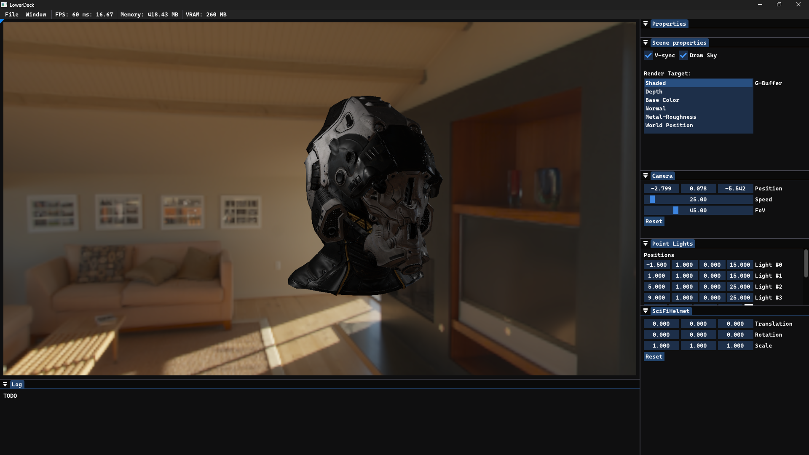
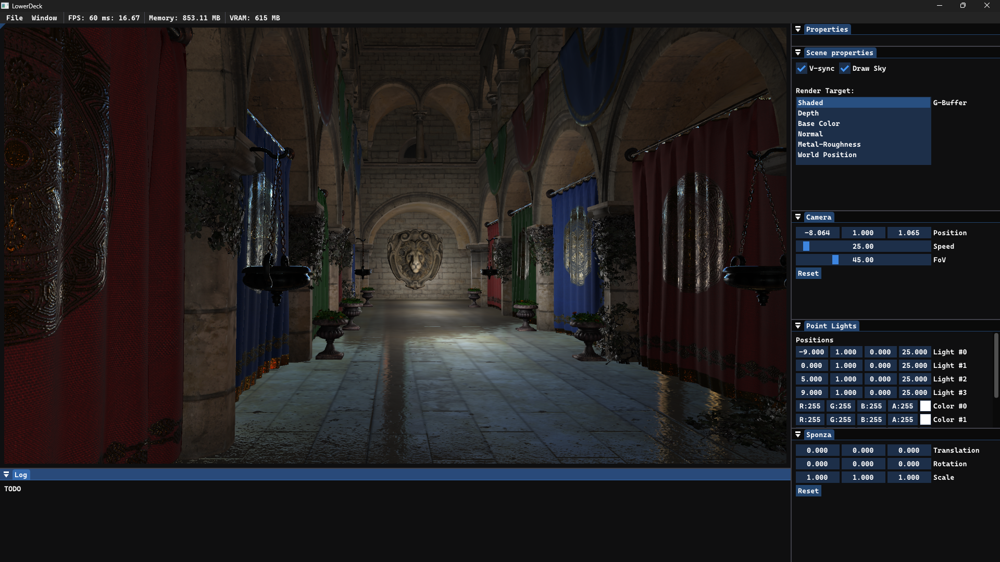

# LowerDeck Engine

<!--TOC-->
  - [**Overview**](#overview)
  - [**Features**](#features)
  - [**Built with**](#built-with)
  - [**Dependencies**](#dependencies)
  - [**Controls**](#controls)
  - [**Sample screenshots**](#sample-screenshots)
<!--/TOC-->

## **Overview**
**WIP** - calling it *engine* at this point is an overstatement.

Restructured and improved version of my other project: [**DirectX 12 Rendering**](https://github.com/LowerDeckBoy/DirectX-12-Rendering).

Current goals are focused more on ECS based graphics pipeline workflow for hybrid rendering path rather then graphics techniques.

## **Features**
- [x] **Deferred Rendering**:
    - [ ] Tile-Based 
- [x] **Bindless Resources**:
    - [x] Textures
    - [x] Buffers
- [ ] **DXR**:
    - [ ] Raytraced Shadows
    - [ ] Raytraced Ambient Occlusion
    - [ ] Raytraced Reflections
- [x] **Shaders**:
    - [x] **SM6.x** support - **default**
    - [x] **SM5.x** support
- [ ] **Mesh Shading**:
    - [ ] Meshlets
    - [ ] Amplification/Tesselation
- [x] **Image Based Lighting**:
    - [x] Diffuse
    - [ ] Specular
- [ ] **Physically Based Rendering**:
    - [x] Epic's UE4 PBR Model
    - [ ] Disney's PBR
    - [ ] Sky reflections
- [ ] **Model loading**:
    - [x] glTF 2.0
    - [ ] glb
    - [ ] fbx
- [ ] **Physics**:
    - [ ] *PhysX*
- [ ] **Particle System**

## **Built with**
- **C++20**
- **DirectX 12**
- **DXR**
- **Visual Studio 2022:**
    - *MSVC*
    - *MSBuild*
    - *Windows SDK*
    - *Win32 API*
- [**vcpkg**](https://www.vcpkg.io)

> [!NOTE]
> Supports **x64** architecture only.
> 
> **HLSL SM6.6** support is required.

## **Dependencies**
- [**D3D12MemoryAllocator**](https://github.com/GPUOpen-LibrariesAndSDKs/D3D12MemoryAllocator)
- [**D3D12 Agility SDK**](https://devblogs.microsoft.com/directx/directx12agility/)
- [**ImGui**](https://github.com/ocornut/imgui)
- [**assimp**](https://github.com/assimp/assimp)
- [**EnTT**](https://github.com/skypjack/entt)
- [**DirectXTex**](https://github.com/microsoft/DirectXTex)
- [**DirectXTK12**](https://github.com/Microsoft/DirectXTK12)

## **Controls**
- Hold **RMB** to enable camera movement.
- **WASD** to move scene camera around.
- **E** to move camera up, **Q** to move camera down.
- **R** resets camera position and rotation.
- **ESC** to exit app.

## **Sample screenshots**

|         |         |
|:-------:|:-------:|
|||
